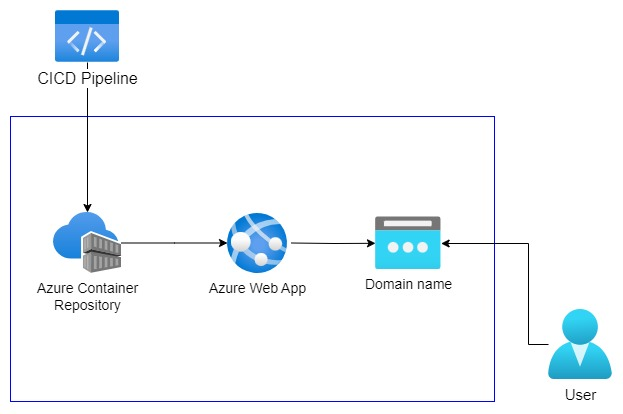

# streamlit-azure-demo

## Description

A toy infrastructure on Azure for hosting a publicly accessible streamlit Web application. Once the infrastructure is deployed ([see the instructions below](#deployment-and-destrution)), the app is available at https://webapp-streamlittoyapp.azurewebsites.net/

## Features

* automatic insfastructure deployment and destruction
* purging all the older images in the ACR to retain the latest image only at every `terrform apply`
* rebuilding and uploading the application image to the ACR on every `terraform apply`

## Deployment and Destrution

The app can be deployed in three ways:

* via manual execution in the GitHub UI (`Actions` tab -> `deploy` -> `Run Wornflow`)
* via Github Workflows (on push)
* locally with the `terraform_deploy.sh` script

For the sake of cost optimization for this toy project, the whole insfrastructure can be taken down by:

* manually triggering the `destroy` workflow in the GitHub UI
* running the `terraform_destroy.sh` script
